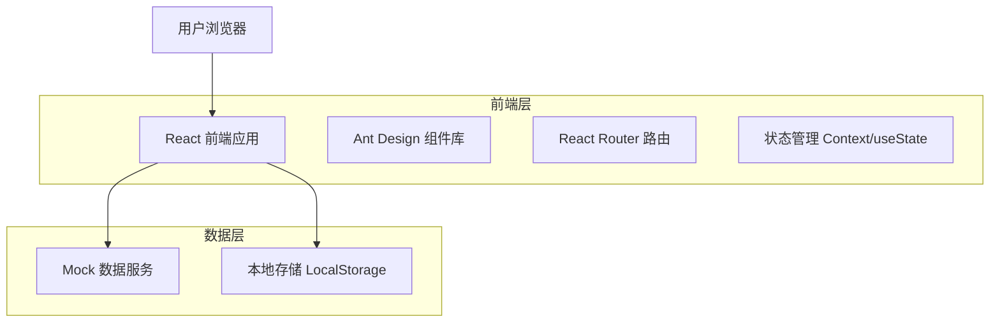

# naodongAI 技术架构文档

## 1. 架构设计



## 2. 技术描述

- 前端：React@18 + Ant Design@5 + Vite@5
- 路由：React Router@6
- 状态管理：React Context + useState/useReducer
- 样式：Ant Design + CSS Modules
- 构建工具：Vite
- 开发工具：ESLint + Prettier

## 3. 路由定义

| 路由 | 用途 |
|------|------|
| / | 主页，展示三栏布局的AI工具工作区 |
| /login | 登录页面，支持微信扫码、手机号、账号密码登录 |
| /profile | 个人中心，用户信息、积分、会员管理 |
| /subscription | 订阅系统，会员套餐选择和购买 |

## 4. 组件架构

### 4.1 核心组件结构

```
src/
├── components/
│   ├── Layout/
│   │   ├── Header.jsx          # 顶部导航栏
│   │   ├── Sidebar.jsx         # 左侧工具选择栏
│   │   ├── WorkArea.jsx        # 中间操作区
│   │   └── ResultPanel.jsx     # 右侧结果区
│   ├── Tools/
│   │   ├── AIModel.jsx         # AI模特工具
│   │   ├── TryOnClothes.jsx    # 试衣工具
│   │   ├── SameStyleTryOn.jsx  # 同版型试衣
│   │   ├── ShoesTryOn.jsx      # 鞋子上脚
│   │   ├── GlassesTryOn.jsx    # 眼镜试戴
│   │   ├── PoseVariation.jsx   # 姿势裂变
│   │   ├── ModelVideo.jsx      # 模特视频
│   │   ├── SceneChange.jsx     # 场景更换
│   │   └── ColorChange.jsx     # 商品换色
│   ├── User/
│   │   ├── LoginModal.jsx      # 登录弹窗
│   │   ├── UserProfile.jsx     # 用户资料
│   │   └── SubscriptionCard.jsx # 订阅卡片
│   └── Common/
│       ├── ImageUpload.jsx     # 图片上传组件
│       ├── PromptInput.jsx     # 提示词输入
│       └── GenerateButton.jsx  # 生成按钮
├── pages/
│   ├── Home.jsx               # 主页
│   ├── Login.jsx              # 登录页
│   ├── Profile.jsx            # 个人中心
│   └── Subscription.jsx       # 订阅页面
├── hooks/
│   ├── useAuth.js             # 用户认证钩子
│   ├── useCredits.js          # 积分管理钩子
│   └── useTools.js            # 工具状态钩子
├── services/
│   ├── mockApi.js             # Mock API服务
│   └── storage.js             # 本地存储服务
└── utils/
    ├── constants.js           # 常量定义
    └── helpers.js             # 工具函数
```

### 4.2 主要功能模块

**工具选择模块 (Sidebar)**
- 展示所有AI工具图标和名称
- 支持工具分类（服饰版、商品版）
- 工具切换时更新中间操作区

**操作区模块 (WorkArea)**
- 动态渲染对应工具的操作界面
- 通用控件：图片上传、文本输入、选择器、生成按钮
- 参数配置：模型选择、风格设置、比例调整

**结果展示模块 (ResultPanel)**
- 生成结果图片展示
- 操作按钮：下载、再次生成、收藏
- 生成历史记录

**用户系统模块**
- 登录状态管理
- 积分余额显示
- 会员状态展示

## 5. 数据模型

### 5.1 用户数据模型

```typescript
interface User {
  id: string;
  username: string;
  avatar?: string;
  credits: number;
  membershipType: 'free' | 'vip';
  membershipExpiry?: Date;
  loginMethod: 'wechat' | 'phone' | 'password';
}
```

### 5.2 工具数据模型

```typescript
interface AITool {
  id: string;
  name: string;
  icon: string;
  category: 'fashion' | 'product';
  description: string;
  creditCost: number;
  parameters: ToolParameter[];
}

interface ToolParameter {
  name: string;
  type: 'text' | 'select' | 'upload' | 'slider';
  label: string;
  required: boolean;
  options?: string[];
  placeholder?: string;
}
```

### 5.3 生成结果模型

```typescript
interface GenerationResult {
  id: string;
  toolId: string;
  userId: string;
  inputParams: Record<string, any>;
  resultImage: string;
  createdAt: Date;
  creditsCost: number;
}
```

## 6. Mock 数据服务

### 6.1 工具配置数据

```javascript
const mockTools = [
  {
    id: 'ai-model',
    name: 'AI模特',
    icon: '/icons/ai-model.svg',
    category: 'fashion',
    creditCost: 10,
    parameters: [
      { name: 'image', type: 'upload', label: '上传服装图片', required: true },
      { name: 'style', type: 'select', label: '风格选择', options: ['时尚', '休闲', '商务'] },
      { name: 'prompt', type: 'text', label: '描述词', placeholder: '输入详细描述...' }
    ]
  },
  // ... 其他工具配置
];
```

### 6.2 用户状态管理

```javascript
const mockUser = {
  id: 'user_001',
  username: '用户001',
  credits: 100,
  membershipType: 'free',
  loginMethod: 'wechat'
};
```

## 7. 响应式设计

- 桌面端：三栏布局，左侧250px，右侧300px，中间自适应
- 平板端：左侧栏可折叠，右侧栏下移至底部
- 移动端：单栏布局，通过标签页切换功能区域

## 8. 性能优化

- 组件懒加载：工具组件按需加载
- 图片优化：支持WebP格式，压缩上传
- 状态管理：避免不必要的重渲染
- 缓存策略：本地存储用户设置和生成历史