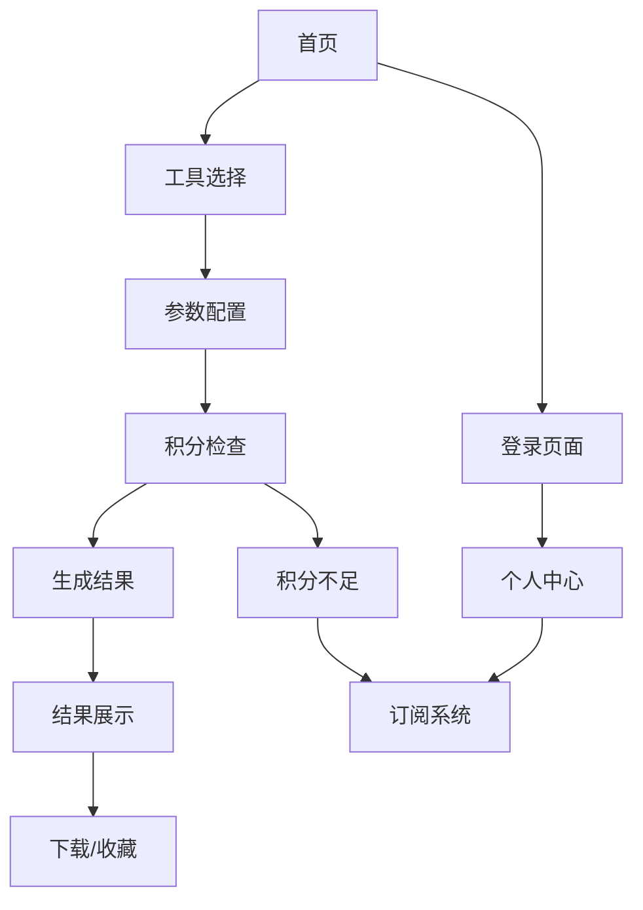

# 脑洞AI - 多功能AI生成工具平台产品需求文档

## 1. 产品概述
脑洞AI是一个多功能在线AI生成工具平台，为用户提供直观的AI生成体验，包括AI模特、试衣、换色等9种核心AI工具。
产品采用三栏工作区布局，参考psai.cn的简洁设计风格，支持微信登录、积分消费和会员服务。
目标是为普通用户提供便捷的AI生成服务，同时为管理员提供灵活的工具配置和运营管理能力。

## 2. 核心功能

### 2.1 用户角色
| 角色 | 注册方式 | 核心权限 |
|------|----------|----------|
| 游客用户 | 无需注册 | 可浏览页面和工具介绍，无法使用生成功能 |
| 普通用户 | 微信/手机号/账号密码注册 | 拥有基础积分，可使用所有生成功能，按次消耗积分 |
| VIP会员 | 付费升级 | 享受生成折扣、专属功能、优先处理等特权 |
| 系统管理员 | 后台分配 | 拥有全部管理权限，可配置工具、管理用户、财务管理 |

### 2.2 功能模块
我们的脑洞AI平台包含以下主要页面：
1. **主工作区页面**：三栏布局，左侧工具选择，中间操作区，右侧结果展示
2. **登录注册页面**：支持微信扫码、手机号验证、账号密码三种登录方式
3. **个人中心页面**：用户信息管理、积分余额、会员状态、生成历史
4. **订阅系统页面**：会员套餐选择、积分充值、支付管理

### 2.3 页面详情
| 页面名称 | 模块名称 | 功能描述 |
|----------|----------|----------|
| 主工作区页面 | 顶部导航栏 | 显示网站Logo、用户积分余额、会员状态、登录入口 |
| 主工作区页面 | 左侧工具栏 | 展示9种AI工具图标，按服饰版/商品版分类，支持工具切换 |
| 主工作区页面 | 中间操作区 | 动态显示选中工具的参数配置界面，包含图片上传、文本输入、选择器等控件 |
| 主工作区页面 | 右侧结果区 | 展示生成结果图片，提供下载、重新生成、收藏功能，显示生成历史 |
| 登录注册页面 | 微信登录 | 显示微信二维码，支持扫码登录 |
| 登录注册页面 | 手机登录 | 手机号输入、验证码发送和验证 |
| 登录注册页面 | 账号登录 | 用户名/邮箱和密码登录，支持记住登录状态 |
| 个人中心页面 | 基本信息 | 显示用户头像、昵称、登录方式、注册时间 |
| 个人中心页面 | 积分管理 | 显示当前积分余额、消费记录、充值入口 |
| 个人中心页面 | 会员中心 | 显示会员状态、到期时间、续费入口、会员特权说明 |
| 个人中心页面 | 生成历史 | 展示用户的AI生成记录，支持查看、下载、删除 |
| 订阅系统页面 | 会员套餐 | 展示不同会员套餐的价格、权益对比、购买按钮 |
| 订阅系统页面 | 积分充值 | 提供不同面额的积分包选择，集成支付宝支付 |
| 订阅系统页面 | 订单记录 | 显示用户的充值和订阅订单历史 |

## 3. 核心流程

**普通用户使用流程：**
用户访问网站 → 浏览工具介绍 → 注册登录 → 选择AI工具 → 配置参数 → 消耗积分生成 → 查看结果 → 下载或收藏

**会员用户流程：**
普通用户 → 查看会员特权 → 选择套餐 → 支付开通 → 享受折扣生成 → 管理会员状态

**积分充值流程：**
用户登录 → 查看积分余额 → 选择充值套餐 → 支付宝支付 → 积分到账 → 继续使用

## 4. 用户界面设计

### 4.1 设计风格
- **主色调**：蓝色系 (#1890ff) 作为主色，灰色系 (#f5f5f5) 作为背景色
- **按钮样式**：圆角按钮，主要按钮使用渐变效果，次要按钮使用线框样式
- **字体**：中文使用苹方/微软雅黑，英文使用 Roboto，主要字号 14px，标题 16-24px
- **布局风格**：卡片式布局，顶部导航 + 三栏工作区，响应式设计
- **图标风格**：线性图标风格，统一使用 Ant Design 图标库

### 4.2 页面设计概览

| 页面名称 | 模块名称 | UI元素 |
|----------|----------|--------|
| 主工作区页面 | 顶部导航栏 | 白色背景，高度60px，Logo左对齐，用户信息右对齐，阴影效果 |
| 主工作区页面 | 左侧工具栏 | 宽度250px，浅灰背景，工具图标64x64px，分类标题加粗显示 |
| 主工作区页面 | 中间操作区 | 白色背景，内边距24px，表单控件垂直排列，间距16px |
| 主工作区页面 | 右侧结果区 | 宽度300px，白色背景，图片网格布局，操作按钮悬浮显示 |
| 登录注册页面 | 登录卡片 | 居中布局，宽度400px，白色背景，圆角8px，阴影效果 |
| 个人中心页面 | 信息卡片 | 网格布局，每个卡片白色背景，标题蓝色，数据大字号显示 |
| 订阅系统页面 | 套餐卡片 | 三列布局，推荐套餐蓝色边框，价格大字号红色显示，特权列表图标对齐 |

### 4.3 响应式设计
产品采用桌面优先的响应式设计，支持桌面端、平板端和移动端：
- **桌面端**：三栏布局，左侧250px，右侧300px，中间自适应
- **平板端**：左侧栏可折叠，右侧栏移至底部，支持触摸操作
- **移动端**：单栏布局，通过底部标签页切换功能区域，优化触摸体验