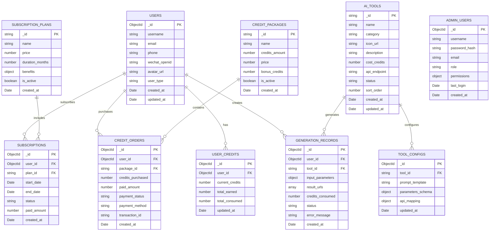

# 脑洞AI后台管理系统与主网站集成技术架构文档

## 1. 架构设计


## 2. 技术描述

* **前端**: React\@18 + Ant Design\@5 + Vite + React Router

* **后端**: Node.js\@18 + Express\@4 + TypeScript + Mongoose\@7

* **数据库**: MongoDB\@6 + Redis

* **文件存储**: MongoDB GridFS 或 阿里云OSS

* **认证**: JWT + bcrypt

* **支付**: 支付宝开放平台API

## 3. 路由定义

### 3.1 后台管理系统路由

| 路由                      | 用途                  |
| ----------------------- | ------------------- |
| /admin/login            | 管理员登录页面             |
| /admin/dashboard        | 仪表板，显示系统概览和关键指标     |
| /admin/tools            | AI工具管理页面，支持工具的增删改查  |
| /admin/tools/:id/config | 工具详细配置页面，管理提示词模板和参数 |
| /admin/apis             | API接口管理页面，配置第三方AI服务 |
| /admin/users            | 用户管理页面，查看用户信息和积分记录  |
| /admin/credits          | 积分与会员管理页面           |
| /admin/settings         | 系统设置页面              |

### 3.2 主网站路由

| 路由            | 用途                 |
| ------------- | ------------------ |
| /             | 主工作区页面，三栏布局的AI生成界面 |
| /login        | 用户登录注册页面           |
| /profile      | 个人中心页面，用户信息和生成历史   |
| /subscription | 订阅系统页面，会员套餐和积分充值   |

## 4. API定义

### 4.1 认证相关API

**管理员登录**

```
POST /api/admin/auth/login
```

Request:

| 参数名      | 参数类型   | 是否必需 | 描述     |
| -------- | ------ | ---- | ------ |
| username | string | true | 管理员用户名 |
| password | string | true | 密码     |

Response:

| 参数名     | 参数类型    | 描述      |
| ------- | ------- | ------- |
| success | boolean | 登录状态    |
| token   | string  | JWT访问令牌 |
| user    | object  | 管理员信息   |

**用户认证**

```
POST /api/auth/login
```

Request:

| 参数名          | 参数类型   | 是否必需  | 描述                          |
| ------------ | ------ | ----- | --------------------------- |
| type         | string | true  | 登录类型: wechat/phone/password |
| phone        | string | false | 手机号（手机登录时必需）                |
| code         | string | false | 验证码（手机登录时必需）                |
| username     | string | false | 用户名（密码登录时必需）                |
| password     | string | false | 密码（密码登录时必需）                 |
| wechat\_code | string | false | 微信授权码（微信登录时必需）              |

### 4.2 AI工具管理API

**获取工具列表**

```
GET /api/admin/tools
```

Response:

```json
{
  "success": true,
  "data": [
    {
      "id": "ai-model",
      "name": "AI模特",
      "category": "服饰版",
      "status": "active",
      "icon": "https://example.com/icon.png",
      "description": "AI生成模特图片",
      "cost_credits": 10,
      "api_endpoint": "/api/ai/model",
      "config": {
        "prompt_template": "生成{style}风格的{gender}模特，穿着{clothing}",
        "parameters": [
          {
            "name": "style",
            "type": "select",
            "options": ["时尚", "商务", "休闲"],
            "required": true
          },
          {
            "name": "image",
            "type": "upload",
            "accept": "image/*",
            "required": true
          },
          {
            "name": "resolution",
            "type": "select",
            "options": ["512x512", "768x768", "1024x1024"],
            "default": "768x768"
          }
        ]
      }
    }
  ]
}
```

**创建/更新工具**

```
POST /api/admin/tools
PUT /api/admin/tools/:id
```

Request:

| 参数名           | 参数类型   | 是否必需 | 描述      |
| ------------- | ------ | ---- | ------- |
| name          | string | true | 工具名称    |
| category      | string | true | 工具分类    |
| icon          | string | true | 工具图标URL |
| description   | string | true | 工具描述    |
| cost\_credits | number | true | 消耗积分数   |
| api\_endpoint | string | true | API端点   |
| config        | object | true | 工具配置对象  |

### 4.3 用户管理API

**获取用户列表**

```
GET /api/admin/users?page=1&pageSize=20&search=keyword
```

**调整用户积分**

```
POST /api/admin/users/:id/credits
```

Request:

| 参数名      | 参数类型   | 是否必需 | 描述                |
| -------- | ------ | ---- | ----------------- |
| amount   | number | true | 积分变动数量（正数增加，负数减少） |
| reason   | string | true | 操作原因              |
| operator | string | true | 操作员ID             |

### 4.4 AI生成API

**执行AI生成**

```
POST /api/ai/generate
```

Request:

| 参数名        | 参数类型   | 是否必需 | 描述   |
| ---------- | ------ | ---- | ---- |
| tool\_id   | string | true | 工具ID |
| parameters | object | true | 生成参数 |
| user\_id   | string | true | 用户ID |

Response:

```json
{
  "success": true,
  "data": {
    "task_id": "task_123456",
    "status": "processing",
    "estimated_time": 30,
    "cost_credits": 10
  }
}
```

**查询生成结果**

```
GET /api/ai/generate/:task_id
```

### 4.5 积分系统API

**获取积分记录**

```
GET /api/credits/records?user_id=123&page=1&pageSize=20
```

**积分充值**

```
POST /api/credits/recharge
```

Request:

| 参数名             | 参数类型   | 是否必需 | 描述     |
| --------------- | ------ | ---- | ------ |
| package\_id     | string | true | 充值套餐ID |
| payment\_method | string | true | 支付方式   |

### 4.6 订阅系统API

**获取会员套餐**

```
GET /api/subscription/plans
```

**开通会员**

```
POST /api/subscription/subscribe
```

Request:

| 参数名             | 参数类型   | 是否必需 | 描述      |
| --------------- | ------ | ---- | ------- |
| plan\_id        | string | true | 套餐ID    |
| duration        | number | true | 订阅时长（月） |
| payment\_method | string | true | 支付方式    |

## 5. 服务器架构图


## 6. 数据模型

### 6.1 MongoDB 集合设计



### 6.2 MongoDB 集合结构和索引设计

**用户集合 (users)**

```javascript
// Mongoose Schema 定义
const userSchema = new mongoose.Schema({
  username: { type: String, required: true, unique: true, maxlength: 50 },
  email: { type: String, unique: true, sparse: true },
  phone: { type: String, unique: true, sparse: true },
  wechat_openid: { type: String, unique: true, sparse: true },
  avatar_url: String,
  user_type: { type: String, enum: ['normal', 'vip'], default: 'normal' },
  created_at: { type: Date, default: Date.now },
  updated_at: { type: Date, default: Date.now }
});

// 创建索引
userSchema.index({ username: 1 });
userSchema.index({ email: 1 });
userSchema.index({ phone: 1 });
userSchema.index({ wechat_openid: 1 });

// 初始化数据示例
db.users.insertMany([
  {
    username: "testuser",
    email: "test@example.com",
    user_type: "normal",
    created_at: new Date(),
    updated_at: new Date()
  }
]);
```

**用户积分集合 (user\_credits)**

```javascript
// Mongoose Schema 定义
const userCreditsSchema = new mongoose.Schema({
  user_id: { type: mongoose.Schema.Types.ObjectId, ref: 'User', required: true, unique: true },
  current_credits: { type: Number, default: 0 },
  total_earned: { type: Number, default: 0 },
  total_consumed: { type: Number, default: 0 },
  updated_at: { type: Date, default: Date.now }
});

// 创建索引
userCreditsSchema.index({ user_id: 1 }, { unique: true });
```

**AI工具集合 (ai\_tools)**

```javascript
// Mongoose Schema 定义
const aiToolSchema = new mongoose.Schema({
  _id: { type: String, required: true }, // 使用字符串作为主键
  name: { type: String, required: true, maxlength: 100 },
  category: { type: String, required: true, maxlength: 50 },
  icon_url: String,
  description: String,
  cost_credits: { type: Number, default: 1 },
  api_endpoint: String,
  status: { type: String, enum: ['active', 'inactive', 'maintenance'], default: 'active' },
  sort_order: { type: Number, default: 0 },
  created_at: { type: Date, default: Date.now },
  updated_at: { type: Date, default: Date.now }
});

// 创建索引
aiToolSchema.index({ category: 1 });
aiToolSchema.index({ status: 1 });
aiToolSchema.index({ sort_order: 1 });

// 初始化数据
db.ai_tools.insertMany([
  {
    _id: "text-to-image",
    name: "文字生图",
    category: "图像生成",
    description: "根据文字描述生成图像",
    cost_credits: 2,
    status: "active",
    sort_order: 1
  }
]);
```

**工具配置集合 (tool\_configs)**

```javascript
// Mongoose Schema 定义
const toolConfigSchema = new mongoose.Schema({
  tool_id: { type: String, ref: 'AiTool', required: true, unique: true },
  prompt_template: String,
  parameters_schema: mongoose.Schema.Types.Mixed,
  api_mapping: mongoose.Schema.Types.Mixed,
  updated_at: { type: Date, default: Date.now }
});

// 创建索引
toolConfigSchema.index({ tool_id: 1 }, { unique: true });
```

**生成记录集合 (generation\_records)**

```javascript
// Mongoose Schema 定义
const generationRecordSchema = new mongoose.Schema({
  user_id: { type: mongoose.Schema.Types.ObjectId, ref: 'User', required: true },
  tool_id: { type: String, ref: 'AiTool', required: true },
  input_parameters: mongoose.Schema.Types.Mixed,
  result_urls: [String],
  credits_consumed: { type: Number, default: 0 },
  status: { type: String, enum: ['pending', 'processing', 'completed', 'failed'], default: 'pending' },
  error_message: String,
  created_at: { type: Date, default: Date.now }
});

// 创建索引
generationRecordSchema.index({ user_id: 1 });
generationRecordSchema.index({ tool_id: 1 });
generationRecordSchema.index({ status: 1 });
generationRecordSchema.index({ created_at: -1 });
```

**会员套餐集合 (subscription\_plans)**

```javascript
// Mongoose Schema 定义
const subscriptionPlanSchema = new mongoose.Schema({
  _id: { type: String, required: true }, // 使用字符串作为主键
  name: { type: String, required: true, maxlength: 100 },
  price: { type: Number, required: true },
  duration_months: { type: Number, required: true },
  benefits: mongoose.Schema.Types.Mixed,
  is_active: { type: Boolean, default: true },
  created_at: { type: Date, default: Date.now }
});

// 初始化数据
db.subscription_plans.insertMany([
  {
    _id: "basic",
    name: "基础会员",
    price: 29.90,
    duration_months: 1,
    benefits: { discount: 0.9, priority: false, exclusive_tools: [] }
  },
  {
    _id: "premium",
    name: "高级会员",
    price: 79.90,
    duration_months: 3,
    benefits: { discount: 0.8, priority: true, exclusive_tools: ["premium-model"] }
  },
  {
    _id: "vip",
    name: "VIP会员",
    price: 199.90,
    duration_months: 12,
    benefits: { discount: 0.7, priority: true, exclusive_tools: ["premium-model", "vip-exclusive"] }
  }
]);
```

**用户订阅集合 (subscriptions)**

```javascript
// Mongoose Schema 定义
const subscriptionSchema = new mongoose.Schema({
  user_id: { type: mongoose.Schema.Types.ObjectId, ref: 'User', required: true },
  plan_id: { type: String, ref: 'SubscriptionPlan', required: true },
  start_date: { type: Date, required: true },
  end_date: { type: Date, required: true },
  status: { type: String, enum: ['active', 'expired', 'cancelled'], default: 'active' },
  paid_amount: { type: Number, required: true },
  created_at: { type: Date, default: Date.now }
});

// 创建索引
subscriptionSchema.index({ user_id: 1 });
subscriptionSchema.index({ status: 1 });
subscriptionSchema.index({ end_date: 1 });
```

**积分套餐集合 (credit\_packages)**

```javascript
// Mongoose Schema 定义
const creditPackageSchema = new mongoose.Schema({
  _id: { type: String, required: true }, // 使用字符串作为主键
  name: { type: String, required: true, maxlength: 100 },
  credits_amount: { type: Number, required: true },
  price: { type: Number, required: true },
  bonus_credits: { type: Number, default: 0 },
  is_active: { type: Boolean, default: true },
  created_at: { type: Date, default: Date.now }
});

// 初始化数据
db.credit_packages.insertMany([
  { _id: "small", name: "小额充值", credits_amount: 100, price: 9.90, bonus_credits: 10 },
  { _id: "medium", name: "标准充值", credits_amount: 500, price: 49.90, bonus_credits: 100 },
  { _id: "large", name: "大额充值", credits_amount: 1000, price: 99.90, bonus_credits: 300 },
  { _id: "mega", name: "超值充值", credits_amount: 2000, price: 199.90, bonus_credits: 800 }
]);
```

**积分订单集合 (credit\_orders)**

```javascript
// Mongoose Schema 定义
const creditOrderSchema = new mongoose.Schema({
  user_id: { type: mongoose.Schema.Types.ObjectId, ref: 'User', required: true },
  package_id: { type: String, ref: 'CreditPackage', required: true },
  credits_purchased: { type: Number, required: true },
  paid_amount: { type: Number, required: true },
  payment_status: { type: String, enum: ['pending', 'paid', 'failed', 'refunded'], default: 'pending' },
  payment_method: String,
  transaction_id: String,
  created_at: { type: Date, default: Date.now }
});

// 创建索引
creditOrderSchema.index({ user_id: 1 });
creditOrderSchema.index({ payment_status: 1 });
creditOrderSchema.index({ created_at: -1 });
```

**管理员用户集合 (admin\_users)**

```javascript
// Mongoose Schema 定义
const adminUserSchema = new mongoose.Schema({
  username: { type: String, required: true, unique: true, maxlength: 50 },
  password_hash: { type: String, required: true },
  email: { type: String, required: true, unique: true },
  role: { type: String, enum: ['super_admin', 'admin', 'operator'], default: 'admin' },
  permissions: mongoose.Schema.Types.Mixed,
  last_login: Date,
  created_at: { type: Date, default: Date.now }
});

// 创建索引
adminUserSchema.index({ username: 1 }, { unique: true });
adminUserSchema.index({ email: 1 }, { unique: true });

// 初始化管理员账户
db.admin_users.insertOne({
  username: "admin",
  password_hash: "$2b$10$example_hash", // 实际使用时需要用bcrypt加密
  email: "admin@naodongai.com",
  role: "super_admin",
  permissions: { all: true },
  created_at: new Date()
});
```

## 7. 安全认证设计

### 7.1 JWT Token 结构

```json
{
  "header": {
    "alg": "HS256",
    "typ": "JWT"
  },
  "payload": {
    "user_id": "uuid",
    "username": "string",
    "user_type": "normal|vip",
    "role": "user|admin",
    "permissions": ["array"],
    "exp": 1234567890,
    "iat": 1234567890
  }
}
```

### 7.2 API安全策略

* 所有API请求必须携带有效的JWT Token

* 管理员API需要额外的角色验证

* 敏感操作需要二次验证

* 实施API请求频率限制

* 所有文件上传需要类型和大小验证

### 7.3 数据库安全

* 使用MongoDB访问控制和角色权限管理

* 用户只能访问自己的数据（通过应用层权限控制）

* 管理员权限通过服务端验证

* 敏感数据加密存储（密码使用bcrypt加密）

* 数据库连接使用SSL/TLS加密

## 8. 部署架构

### 8.1 开发环境

* 前端: Vite Dev Server (localhost:5173, localhost:5175)

* 后端: Node.js Express (localhost:8080)

* 数据库: MongoDB本地实例或MongoDB Atlas

* 文件存储: 本地GridFS或阿里云OSS

### 8.2 生产环境

* 前端: Nginx + 静态文件部署

* 后端: PM2 + Node.js集群

* 数据库: MongoDB Atlas或自建MongoDB集群

* CDN: 阿里云OSS + CDN加速

* 监控: 日志收集 + 性能监控

## 9. 集成开发计划

### 9.1 第一阶段：基础架构搭建

1. 搭建统一后端服务架构
2. 配置MongoDB数据库连接和Mongoose ODM
3. 实现基础的用户认证系统（JWT + bcrypt）
4. 建立前后端通信机制

### 9.2 第二阶段：核心功能开发

1. 实现AI工具管理系统
2. 开发用户积分系统
3. 构建文件上传和存储服务（GridFS或云存储）
4. 集成第三方AI API服务

### 9.3 第三阶段：高级功能完善

1. 实现订阅和支付系统
2. 完善管理后台功能
3. 优化性能和用户体验
4. 部署和上线准备

这个技术架构文档为脑洞AI后台管理系统与主网站的集成提供了完整的技术指导，涵盖了系统架构、API设计、MongoDB数据库设计、安全认证等各个方面，可以作为后续开发工作的重要参考。
