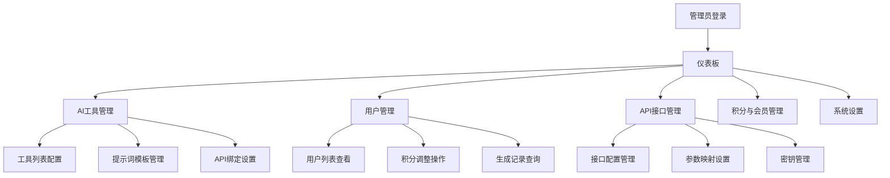

# 脑洞AI后台管理系统产品需求文档

## 1. 产品概述

脑洞AI后台管理系统是一个专为管理员设计的Web应用，用于全面管理脑洞AI网站的各项功能和资源。系统提供直观的界面来管理AI工具、用户、积分、会员套餐等核心业务功能。

该系统旨在为管理员提供高效的管理工具，确保脑洞AI平台的稳定运行和持续优化，同时支持业务的快速扩展和配置调整。

## 2. 核心功能

### 2.1 用户角色

| 角色 | 登录方式 | 核心权限 |
|------|----------|----------|
| 超级管理员 | 账号密码登录 | 拥有所有功能权限，包括系统设置和用户管理 |
| 运营管理员 | 账号密码登录 | 可管理AI工具、用户积分、会员套餐等运营相关功能 |
| 技术管理员 | 账号密码登录 | 可管理API接口、系统配置等技术相关功能 |

### 2.2 功能模块

我们的后台管理系统包含以下主要页面：

1. **仪表板页面**：系统概览、关键指标展示、快捷操作入口
2. **AI工具管理页面**：工具列表管理、提示词模板配置、API绑定设置
3. **API接口管理页面**：接口配置管理、参数映射设置、密钥安全管理
4. **用户管理页面**：用户列表查看、积分调整操作、生成记录查询
5. **积分与会员管理页面**：积分规则配置、会员套餐管理、财务记录查看
6. **系统设置页面**：全局配置管理、网站基础信息设置

### 2.3 页面详情

| 页面名称 | 模块名称 | 功能描述 |
|----------|----------|----------|
| 仪表板页面 | 数据概览 | 显示用户总数、今日活跃用户、积分消耗统计等关键指标 |
| 仪表板页面 | 快捷操作 | 提供常用功能的快速入口，如新增工具、用户管理等 |
| AI工具管理页面 | 工具列表 | 展示所有AI工具，支持启用/停用、排序、分组管理 |
| AI工具管理页面 | 提示词模板 | 管理工具的提示词模板，支持参数占位符如{参数名} |
| AI工具管理页面 | API绑定 | 配置工具对应的后端API地址和请求参数映射 |
| API接口管理页面 | 接口配置 | 维护内部和第三方生成接口的基本信息 |
| API接口管理页面 | 参数映射 | 设置前台控件值到API请求字段的映射关系 |
| API接口管理页面 | 密钥管理 | 安全存储和管理第三方API密钥 |
| 用户管理页面 | 用户列表 | 显示用户基本信息：用户名、微信、注册时间、积分余额 |
| 用户管理页面 | 积分调整 | 为指定用户手动增加或减少积分，记录操作日志 |
| 用户管理页面 | 生成记录 | 查看用户的AI生成历史记录和使用统计 |
| 积分与会员管理页面 | 积分规则 | 按AI工具类型配置积分消耗标准 |
| 积分与会员管理页面 | 会员套餐 | 创建和编辑会员套餐：名称、价格、权益内容 |
| 积分与会员管理页面 | 财务记录 | 查看积分充值订单和会员开通记录 |
| 系统设置页面 | 全局配置 | 设置网站标题、Logo、默认积分赠送规则等 |
| 系统设置页面 | 管理员账户 | 管理后台管理员账户和权限分配 |

## 3. 核心流程

### 管理员操作流程

管理员登录后台系统，首先进入仪表板查看系统整体状况。然后根据需要进入相应的管理模块：

1. **AI工具管理流程**：查看工具列表 → 编辑工具配置 → 设置提示词模板 → 绑定API接口
2. **用户管理流程**：查看用户列表 → 筛选目标用户 → 调整用户积分 → 查看操作记录
3. **系统配置流程**：进入系统设置 → 修改全局配置 → 保存并生效

## 4. 用户界面设计

### 4.1 设计风格

- **主色调**：蓝色系（#1890ff）作为主色，灰色系（#f0f2f5）作为背景色
- **按钮样式**：圆角按钮，主要操作使用蓝色，危险操作使用红色
- **字体**：系统默认字体，标题使用16px，正文使用14px，辅助文字使用12px
- **布局风格**：左侧导航 + 顶部面包屑 + 主内容区域的经典后台布局
- **图标风格**：使用Ant Design图标库，保持风格统一

### 4.2 页面设计概览

| 页面名称 | 模块名称 | UI元素 |
|----------|----------|--------|
| 仪表板页面 | 数据概览 | 卡片式布局，使用统计数字和图表展示关键指标，配色以蓝色和绿色为主 |
| 仪表板页面 | 快捷操作 | 网格布局的操作卡片，每个卡片包含图标、标题和描述 |
| AI工具管理页面 | 工具列表 | 表格布局，包含开关组件、拖拽排序、操作按钮列 |
| AI工具管理页面 | 提示词模板 | 代码编辑器样式的文本框，支持语法高亮显示参数占位符 |
| API接口管理页面 | 接口配置 | 表单布局，包含URL输入框、请求方法选择、状态指示器 |
| 用户管理页面 | 用户列表 | 表格布局，包含头像、用户信息、积分余额、操作按钮 |
| 用户管理页面 | 积分调整 | 模态框形式，包含数字输入框、操作类型选择、备注文本框 |
| 系统设置页面 | 全局配置 | 分组表单布局，使用折叠面板组织不同配置类别 |

### 4.3 响应式设计

系统采用桌面优先的响应式设计，主要适配1920px、1440px、1024px等常见桌面分辨率。在小屏幕设备上，左侧导航会自动折叠，表格支持横向滚动。