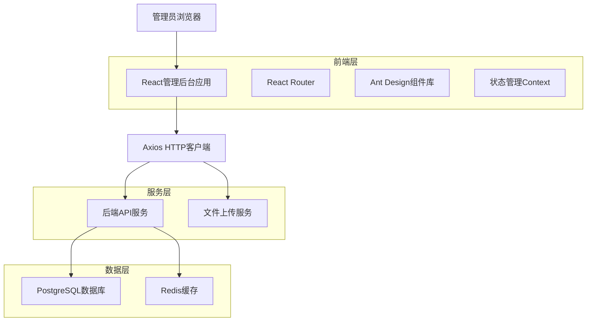
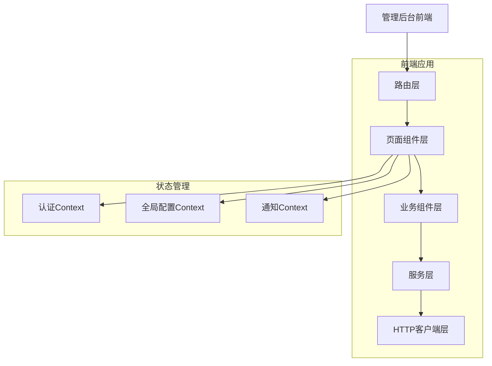
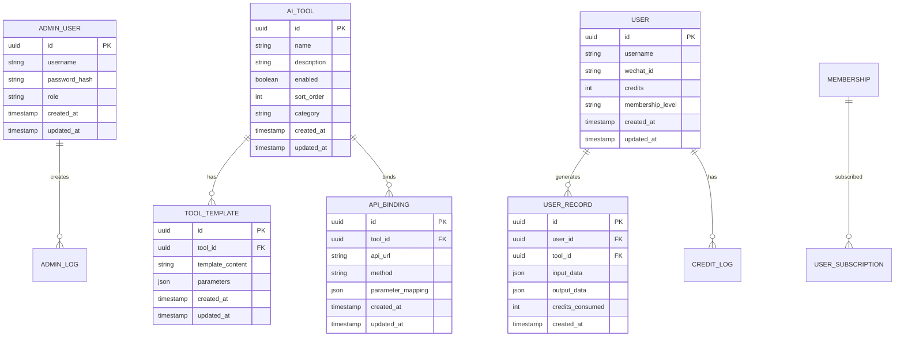

# 脑洞AI后台管理系统技术架构文档

## 1. 架构设计



## 2. 技术描述

- 前端：React@18 + Ant Design@5 + React Router@6 + Axios + Vite
- 状态管理：React Context API
- 构建工具：Vite@4
- 开发服务器：Vite Dev Server (http://localhost:5174)

## 3. 路由定义

| 路由 | 用途 |
|------|------|
| /admin | 管理后台首页，重定向到仪表板 |
| /admin/login | 管理员登录页面 |
| /admin/dashboard | 仪表板页面，显示系统概览和关键指标 |
| /admin/tools | AI工具管理页面，管理工具列表和配置 |
| /admin/tools/templates | 提示词模板管理页面 |
| /admin/apis | API接口管理页面，配置接口和密钥 |
| /admin/users | 用户管理页面，查看用户列表和积分调整 |
| /admin/credits | 积分与会员管理页面，配置规则和套餐 |
| /admin/settings | 系统设置页面，全局配置管理 |

## 4. API定义

### 4.1 核心API

管理员认证相关
```
POST /api/admin/auth/login
```

请求：
| 参数名 | 参数类型 | 是否必需 | 描述 |
|--------|----------|----------|------|
| username | string | true | 管理员用户名 |
| password | string | true | 管理员密码 |

响应：
| 参数名 | 参数类型 | 描述 |
|--------|----------|------|
| success | boolean | 登录是否成功 |
| token | string | JWT认证令牌 |
| user | object | 管理员用户信息 |

示例：
```json
{
  "username": "admin",
  "password": "admin123"
}
```

AI工具管理相关
```
GET /api/admin/tools
POST /api/admin/tools
PUT /api/admin/tools/:id
DELETE /api/admin/tools/:id
```

用户管理相关
```
GET /api/admin/users
PUT /api/admin/users/:id/credits
GET /api/admin/users/:id/records
```

系统配置相关
```
GET /api/admin/settings
PUT /api/admin/settings
```

## 5. 服务器架构图



## 6. 数据模型

### 6.1 数据模型定义



### 6.2 数据定义语言

管理员用户表 (admin_users)
```sql
-- 创建管理员用户表
CREATE TABLE admin_users (
    id UUID PRIMARY KEY DEFAULT gen_random_uuid(),
    username VARCHAR(50) UNIQUE NOT NULL,
    password_hash VARCHAR(255) NOT NULL,
    role VARCHAR(20) DEFAULT 'admin' CHECK (role IN ('super_admin', 'operation_admin', 'tech_admin')),
    created_at TIMESTAMP WITH TIME ZONE DEFAULT NOW(),
    updated_at TIMESTAMP WITH TIME ZONE DEFAULT NOW()
);

-- 创建索引
CREATE INDEX idx_admin_users_username ON admin_users(username);
CREATE INDEX idx_admin_users_role ON admin_users(role);

-- 初始化数据
INSERT INTO admin_users (username, password_hash, role) VALUES
('admin', '$2b$10$hash_here', 'super_admin'),
('operation', '$2b$10$hash_here', 'operation_admin'),
('tech', '$2b$10$hash_here', 'tech_admin');
```

AI工具表 (ai_tools)
```sql
-- 创建AI工具表
CREATE TABLE ai_tools (
    id UUID PRIMARY KEY DEFAULT gen_random_uuid(),
    name VARCHAR(100) NOT NULL,
    description TEXT,
    enabled BOOLEAN DEFAULT true,
    sort_order INTEGER DEFAULT 0,
    category VARCHAR(50),
    icon_url VARCHAR(255),
    created_at TIMESTAMP WITH TIME ZONE DEFAULT NOW(),
    updated_at TIMESTAMP WITH TIME ZONE DEFAULT NOW()
);

-- 创建索引
CREATE INDEX idx_ai_tools_enabled ON ai_tools(enabled);
CREATE INDEX idx_ai_tools_category ON ai_tools(category);
CREATE INDEX idx_ai_tools_sort_order ON ai_tools(sort_order);
```

提示词模板表 (tool_templates)
```sql
-- 创建提示词模板表
CREATE TABLE tool_templates (
    id UUID PRIMARY KEY DEFAULT gen_random_uuid(),
    tool_id UUID REFERENCES ai_tools(id) ON DELETE CASCADE,
    template_content TEXT NOT NULL,
    parameters JSONB,
    created_at TIMESTAMP WITH TIME ZONE DEFAULT NOW(),
    updated_at TIMESTAMP WITH TIME ZONE DEFAULT NOW()
);

-- 创建索引
CREATE INDEX idx_tool_templates_tool_id ON tool_templates(tool_id);
```

API绑定表 (api_bindings)
```sql
-- 创建API绑定表
CREATE TABLE api_bindings (
    id UUID PRIMARY KEY DEFAULT gen_random_uuid(),
    tool_id UUID REFERENCES ai_tools(id) ON DELETE CASCADE,
    api_url VARCHAR(500) NOT NULL,
    method VARCHAR(10) DEFAULT 'POST',
    parameter_mapping JSONB,
    api_key_encrypted TEXT,
    created_at TIMESTAMP WITH TIME ZONE DEFAULT NOW(),
    updated_at TIMESTAMP WITH TIME ZONE DEFAULT NOW()
);

-- 创建索引
CREATE INDEX idx_api_bindings_tool_id ON api_bindings(tool_id);
```

系统配置表 (system_settings)
```sql
-- 创建系统配置表
CREATE TABLE system_settings (
    id UUID PRIMARY KEY DEFAULT gen_random_uuid(),
    key VARCHAR(100) UNIQUE NOT NULL,
    value JSONB,
    description TEXT,
    created_at TIMESTAMP WITH TIME ZONE DEFAULT NOW(),
    updated_at TIMESTAMP WITH TIME ZONE DEFAULT NOW()
);

-- 创建索引
CREATE INDEX idx_system_settings_key ON system_settings(key);

-- 初始化配置数据
INSERT INTO system_settings (key, value, description) VALUES
('site_title', '"脑洞AI"', '网站标题'),
('default_credits', '100', '新用户默认积分'),
('logo_url', '"/logo.png"', '网站Logo地址');
```