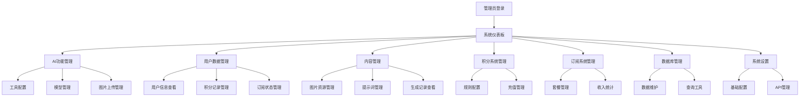

# 脑洞AI后台管理系统集成产品需求文档

## 1. 产品概述

脑洞AI后台管理系统集成项目旨在将独立的后台管理系统与脑洞AI主网站进行深度集成，实现统一的数据管理、AI功能控制和用户服务体系。通过MongoDB数据库作为统一数据存储，建立完整的积分机制和订阅系统，为管理员提供全面的系统管控能力。

该项目解决了当前后台管理系统与主网站数据割裂、功能重复开发、用户体验不一致的问题，为脑洞AI平台提供统一的管理入口和数据中心。

## 2. 核心功能

### 2.1 用户角色

| 角色 | 注册方法 | 核心权限 |
|------|----------|----------|
| 超级管理员 | 系统预设账户 | 全系统管理权限，包括用户管理、AI功能配置、数据库操作、系统设置 |
| 运营管理员 | 超级管理员邀请 | AI工具管理、用户数据查看、积分系统管理、订阅系统管理 |
| 技术管理员 | 超级管理员邀请 | 系统监控、API管理、数据库维护、技术配置 |

### 2.2 功能模块

脑洞AI后台管理系统集成项目包含以下核心页面：

1. **系统仪表板**：系统状态监控、数据统计概览、实时用户活动
2. **AI功能管理页面**：AI工具配置、模型参数设置、功能开关控制
3. **用户数据管理页面**：用户信息查看、积分记录、订阅状态管理
4. **内容管理页面**：图片资源管理、提示词模板、生成记录查看
5. **积分系统管理页面**：积分规则配置、充值记录、消费统计
6. **订阅系统管理页面**：订阅套餐管理、用户订阅状态、收入统计
7. **数据库管理页面**：数据备份恢复、性能监控、查询工具
8. **系统设置页面**：基础配置、API密钥管理、安全设置

### 2.3 页面详情

| 页面名称 | 模块名称 | 功能描述 |
|----------|----------|----------|
| 系统仪表板 | 数据概览 | 显示用户总数、AI生成次数、积分消费统计、系统健康状态 |
| 系统仪表板 | 实时监控 | 当前在线用户、API调用频率、数据库连接状态、服务器资源使用 |
| AI功能管理页面 | 工具配置 | 管理所有AI工具的启用状态、参数设置、使用限制 |
| AI功能管理页面 | 模型管理 | 配置AI模型参数、提示词模板、分辨率选项、生成质量设置 |
| AI功能管理页面 | 图片上传管理 | 设置上传文件大小限制、支持格式、存储路径、缩略图生成 |
| 用户数据管理页面 | 用户信息 | 查看用户基本信息、注册时间、最后活跃时间、使用统计 |
| 用户数据管理页面 | 积分记录 | 查看用户积分获取、消费记录、余额变动、充值历史 |
| 用户数据管理页面 | 订阅状态 | 管理用户订阅信息、到期时间、续费记录、权益使用情况 |
| 内容管理页面 | 图片资源 | 管理用户上传的图片、生成的图片、存储空间使用、批量操作 |
| 内容管理页面 | 提示词管理 | 创建、编辑、删除提示词模板、分类管理、使用统计 |
| 内容管理页面 | 生成记录 | 查看所有AI生成记录、成功率统计、错误日志、性能分析 |
| 积分系统管理页面 | 规则配置 | 设置积分获取规则、消费标准、奖励机制、有效期管理 |
| 积分系统管理页面 | 充值管理 | 管理充值套餐、价格设置、支付方式、充值记录查询 |
| 订阅系统管理页面 | 套餐管理 | 创建、编辑订阅套餐、权益设置、价格管理、有效期配置 |
| 订阅系统管理页面 | 收入统计 | 订阅收入报表、用户转化率、续费率分析、财务数据导出 |
| 数据库管理页面 | 数据维护 | 数据库备份、恢复、清理、索引优化、性能调优 |
| 数据库管理页面 | 查询工具 | 自定义数据查询、报表生成、数据导出、统计分析 |
| 系统设置页面 | 基础配置 | 系统名称、Logo设置、联系信息、服务条款、隐私政策 |
| 系统设置页面 | API管理 | API密钥管理、访问限制、调用统计、安全配置 |

## 3. 核心流程

### 3.1 管理员操作流程

**超级管理员流程：**
1. 登录后台管理系统 → 查看系统仪表板 → 进行系统配置和用户管理
2. AI功能管理 → 配置工具参数 → 设置使用限制 → 监控使用情况
3. 用户数据管理 → 查看用户信息 → 处理用户问题 → 调整用户权限

**运营管理员流程：**
1. 登录系统 → 查看运营数据 → 分析用户行为 → 优化运营策略
2. 积分系统管理 → 设置积分规则 → 监控积分使用 → 处理充值问题
3. 订阅系统管理 → 管理套餐 → 分析订阅数据 → 制定营销策略

**技术管理员流程：**
1. 登录系统 → 检查系统状态 → 监控性能指标 → 处理技术问题
2. 数据库管理 → 执行维护任务 → 优化查询性能 → 备份重要数据
3. API管理 → 监控API调用 → 处理异常请求 → 更新安全配置

## 4. 用户界面设计

### 4.1 设计风格

- **主色调**：深蓝色 (#1890ff) 作为主色，浅蓝色 (#40a9ff) 作为辅助色
- **按钮样式**：圆角按钮设计，支持悬停效果和点击反馈
- **字体**：系统默认字体，标题使用 16-20px，正文使用 14px，小字使用 12px
- **布局风格**：左侧导航 + 顶部面包屑 + 主内容区域的经典后台布局
- **图标风格**：使用 Ant Design 图标库，保持一致的视觉风格

### 4.2 页面设计概览

| 页面名称 | 模块名称 | UI元素 |
|----------|----------|---------|
| 系统仪表板 | 数据概览 | 卡片式布局，使用统计数字、进度条、图表展示关键指标，配色以蓝色系为主 |
| 系统仪表板 | 实时监控 | 实时更新的数据面板，使用绿色表示正常状态，红色表示异常，黄色表示警告 |
| AI功能管理页面 | 工具配置 | 表格形式展示工具列表，每行包含开关按钮、配置按钮、统计信息 |
| AI功能管理页面 | 模型管理 | 表单式配置界面，包含滑块、下拉选择、文本输入框，实时预览效果 |
| 用户数据管理页面 | 用户信息 | 数据表格 + 搜索筛选 + 分页，支持批量操作，用户头像圆形显示 |
| 内容管理页面 | 图片资源 | 网格式图片展示 + 上传拖拽区域，支持预览、下载、删除操作 |
| 积分系统管理页面 | 规则配置 | 分步骤表单，使用步骤条导航，每步包含相关配置项和说明文字 |
| 订阅系统管理页面 | 套餐管理 | 卡片式套餐展示，每个套餐卡片包含价格、权益列表、操作按钮 |
| 数据库管理页面 | 查询工具 | 代码编辑器 + 结果展示区域，支持语法高亮和自动补全 |
| 系统设置页面 | 基础配置 | 分组表单布局，使用折叠面板组织不同类型的设置项 |

### 4.3 响应式设计

系统采用桌面优先的响应式设计，针对大屏幕管理场景优化。在平板设备上，侧边栏可收缩为图标模式；在移动设备上，采用抽屉式导航，确保核心功能在小屏幕上仍可正常使用。所有表格支持横向滚动，表单元素自适应屏幕宽度。