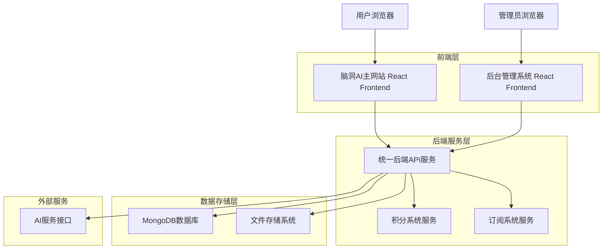
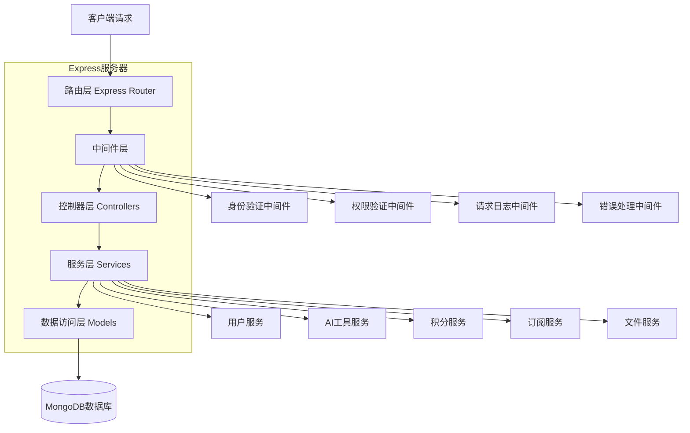
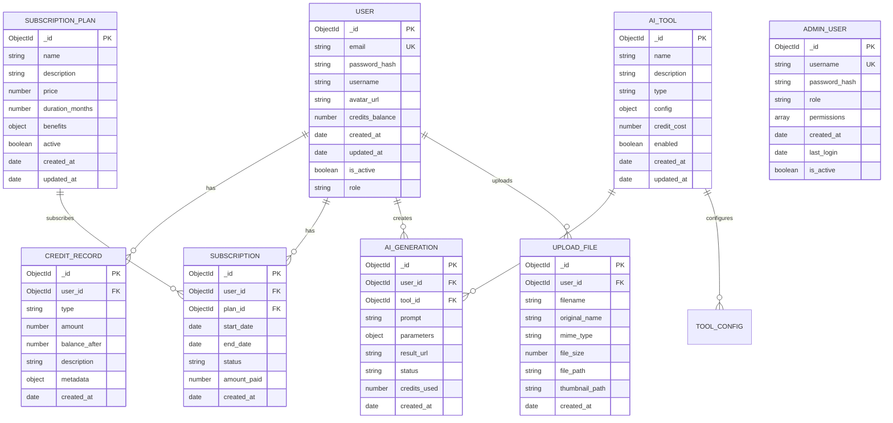

# 脑洞AI后台管理系统集成技术架构文档

## 1. 架构设计



## 2. 技术描述

- **前端**: React@18 + Ant Design@5 + Vite@4 (后台管理系统)
- **前端**: React@18 + Tailwind CSS@3 + Vite@4 (主网站)
- **后端**: Node.js@18 + Express@4 + Mongoose@7
- **数据库**: MongoDB@6 (本地部署)
- **文件存储**: 本地文件系统 + 图片处理库
- **状态管理**: React Context API + localStorage
- **HTTP客户端**: Axios@1
- **身份验证**: JWT + bcrypt

## 3. 路由定义

### 3.1 后台管理系统路由

| 路由 | 用途 |
|------|------|
| /admin/login | 管理员登录页面 |
| /admin/dashboard | 系统仪表板，显示整体数据概览和实时监控 |
| /admin/ai-tools | AI功能管理页面，配置工具参数和模型设置 |
| /admin/users | 用户数据管理页面，查看用户信息和操作记录 |
| /admin/content | 内容管理页面，管理图片资源和提示词模板 |
| /admin/credits | 积分系统管理页面，配置积分规则和充值管理 |
| /admin/subscriptions | 订阅系统管理页面，管理套餐和收入统计 |
| /admin/database | 数据库管理页面，数据维护和查询工具 |
| /admin/settings | 系统设置页面，基础配置和API管理 |

### 3.2 主网站路由

| 路由 | 用途 |
|------|------|
| / | 主页，展示AI工具和用户入口 |
| /login | 用户登录页面 |
| /register | 用户注册页面 |
| /profile | 用户个人中心，查看积分和订阅状态 |
| /tools/:toolId | AI工具使用页面，包含图片上传和参数配置 |
| /gallery | 用户作品展示页面 |
| /subscription | 订阅管理页面，查看套餐和购买 |
| /credits | 积分管理页面，充值和使用记录 |

## 4. API定义

### 4.1 用户认证相关

**管理员登录**
```
POST /api/admin/auth/login
```

请求参数:
| 参数名 | 参数类型 | 是否必需 | 描述 |
|--------|----------|----------|------|
| username | string | true | 管理员用户名 |
| password | string | true | 管理员密码 |

响应参数:
| 参数名 | 参数类型 | 描述 |
|--------|----------|------|
| success | boolean | 登录是否成功 |
| token | string | JWT认证令牌 |
| user | object | 管理员用户信息 |

**用户登录**
```
POST /api/auth/login
```

请求参数:
| 参数名 | 参数类型 | 是否必需 | 描述 |
|--------|----------|----------|------|
| email | string | true | 用户邮箱 |
| password | string | true | 用户密码 |

响应参数:
| 参数名 | 参数类型 | 描述 |
|--------|----------|------|
| success | boolean | 登录是否成功 |
| token | string | JWT认证令牌 |
| user | object | 用户基本信息 |

### 4.2 AI工具管理相关

**获取AI工具列表**
```
GET /api/admin/ai-tools
```

响应参数:
| 参数名 | 参数类型 | 描述 |
|--------|----------|------|
| tools | array | AI工具列表 |
| total | number | 工具总数 |

**更新AI工具配置**
```
PUT /api/admin/ai-tools/:toolId
```

请求参数:
| 参数名 | 参数类型 | 是否必需 | 描述 |
|--------|----------|----------|------|
| name | string | true | 工具名称 |
| enabled | boolean | true | 是否启用 |
| config | object | true | 工具配置参数 |
| creditCost | number | true | 积分消耗 |

### 4.3 用户管理相关

**获取用户列表**
```
GET /api/admin/users
```

请求参数:
| 参数名 | 参数类型 | 是否必需 | 描述 |
|--------|----------|----------|------|
| page | number | false | 页码，默认1 |
| limit | number | false | 每页数量，默认20 |
| search | string | false | 搜索关键词 |

响应参数:
| 参数名 | 参数类型 | 描述 |
|--------|----------|------|
| users | array | 用户列表 |
| total | number | 用户总数 |
| page | number | 当前页码 |

### 4.4 积分系统相关

**获取用户积分记录**
```
GET /api/credits/history/:userId
```

响应参数:
| 参数名 | 参数类型 | 描述 |
|--------|----------|------|
| records | array | 积分记录列表 |
| balance | number | 当前积分余额 |

**积分充值**
```
POST /api/credits/recharge
```

请求参数:
| 参数名 | 参数类型 | 是否必需 | 描述 |
|--------|----------|----------|------|
| userId | string | true | 用户ID |
| amount | number | true | 充值积分数量 |
| paymentMethod | string | true | 支付方式 |

### 4.5 订阅系统相关

**获取订阅套餐**
```
GET /api/subscriptions/plans
```

响应参数:
| 参数名 | 参数类型 | 描述 |
|--------|----------|------|
| plans | array | 订阅套餐列表 |

**用户订阅**
```
POST /api/subscriptions/subscribe
```

请求参数:
| 参数名 | 参数类型 | 是否必需 | 描述 |
|--------|----------|----------|------|
| userId | string | true | 用户ID |
| planId | string | true | 套餐ID |
| duration | number | true | 订阅时长(月) |

## 5. 服务器架构图



## 6. 数据模型

### 6.1 数据模型定义



### 6.2 数据定义语言

**用户表 (users)**
```javascript
// 创建用户集合
db.createCollection("users", {
  validator: {
    $jsonSchema: {
      bsonType: "object",
      required: ["email", "password_hash", "username"],
      properties: {
        email: { bsonType: "string", pattern: "^[a-zA-Z0-9._%+-]+@[a-zA-Z0-9.-]+\.[a-zA-Z]{2,}$" },
        password_hash: { bsonType: "string", minLength: 60 },
        username: { bsonType: "string", minLength: 2, maxLength: 50 },
        credits_balance: { bsonType: "number", minimum: 0 },
        role: { enum: ["user", "premium", "vip"] }
      }
    }
  }
});

// 创建索引
db.users.createIndex({ "email": 1 }, { unique: true });
db.users.createIndex({ "username": 1 }, { unique: true });
db.users.createIndex({ "created_at": -1 });
```

**管理员用户表 (admin_users)**
```javascript
// 创建管理员集合
db.createCollection("admin_users", {
  validator: {
    $jsonSchema: {
      bsonType: "object",
      required: ["username", "password_hash", "role"],
      properties: {
        username: { bsonType: "string", minLength: 3, maxLength: 30 },
        password_hash: { bsonType: "string", minLength: 60 },
        role: { enum: ["super_admin", "operation_admin", "tech_admin"] },
        permissions: { bsonType: "array", items: { bsonType: "string" } }
      }
    }
  }
});

// 创建索引
db.admin_users.createIndex({ "username": 1 }, { unique: true });

// 初始化超级管理员
db.admin_users.insertOne({
  username: "admin",
  password_hash: "$2b$10$example_hash_here",
  role: "super_admin",
  permissions: ["*"],
  created_at: new Date(),
  is_active: true
});
```

**AI工具表 (ai_tools)**
```javascript
// 创建AI工具集合
db.createCollection("ai_tools");

// 创建索引
db.ai_tools.createIndex({ "name": 1 }, { unique: true });
db.ai_tools.createIndex({ "enabled": 1 });

// 初始化AI工具数据
db.ai_tools.insertMany([
  {
    name: "图像生成",
    description: "基于文本提示生成高质量图像",
    type: "image_generation",
    config: {
      max_resolution: "1024x1024",
      supported_styles: ["realistic", "anime", "artistic"],
      max_prompt_length: 500
    },
    credit_cost: 10,
    enabled: true,
    created_at: new Date()
  },
  {
    name: "图像编辑",
    description: "对现有图像进行AI驱动的编辑和优化",
    type: "image_editing",
    config: {
      max_file_size: "10MB",
      supported_formats: ["jpg", "png", "webp"],
      edit_types: ["enhance", "style_transfer", "background_removal"]
    },
    credit_cost: 15,
    enabled: true,
    created_at: new Date()
  }
]);
```

**积分记录表 (credit_records)**
```javascript
// 创建积分记录集合
db.createCollection("credit_records");

// 创建索引
db.credit_records.createIndex({ "user_id": 1, "created_at": -1 });
db.credit_records.createIndex({ "type": 1 });
db.credit_records.createIndex({ "created_at": -1 });
```

**订阅套餐表 (subscription_plans)**
```javascript
// 创建订阅套餐集合
db.createCollection("subscription_plans");

// 创建索引
db.subscription_plans.createIndex({ "active": 1 });

// 初始化订阅套餐
db.subscription_plans.insertMany([
  {
    name: "基础套餐",
    description: "适合个人用户的基础AI功能",
    price: 29.99,
    duration_months: 1,
    benefits: {
      monthly_credits: 1000,
      priority_processing: false,
      advanced_features: false,
      support_level: "basic"
    },
    active: true,
    created_at: new Date()
  },
  {
    name: "专业套餐",
    description: "适合专业用户的全功能AI服务",
    price: 99.99,
    duration_months: 1,
    benefits: {
      monthly_credits: 5000,
      priority_processing: true,
      advanced_features: true,
      support_level: "priority"
    },
    active: true,
    created_at: new Date()
  }
]);
```

**文件上传表 (upload_files)**
```javascript
// 创建文件上传集合
db.createCollection("upload_files");

// 创建索引
db.upload_files.createIndex({ "user_id": 1, "created_at": -1 });
db.upload_files.createIndex({ "file_path": 1 }, { unique: true });
db.upload_files.createIndex({ "created_at": -1 });
```