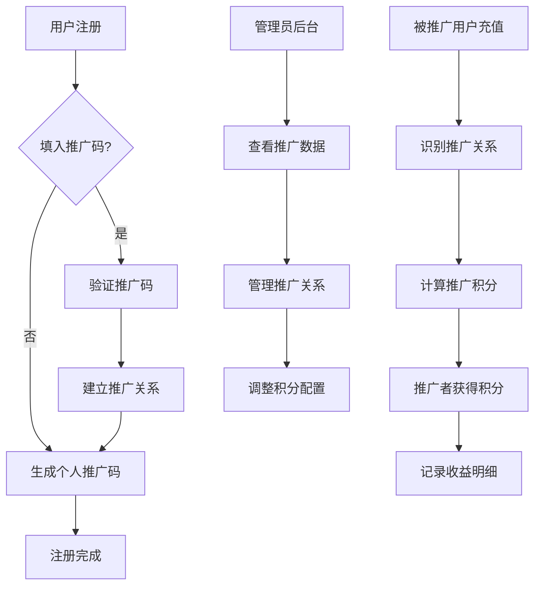

# 脑洞AI用户推广系统产品需求文档

## 1. 产品概述

脑洞AI用户推广系统是一个完整的用户增长营销平台，通过推广码机制实现用户裂变增长。系统为每个用户生成唯一推广码，当被推广用户完成首次充值后，推广者获得相应积分奖励，形成良性的用户增长循环。

- 核心目标：通过推广激励机制实现用户快速增长，提升用户活跃度和平台收入
- 目标用户：所有注册用户都可成为推广者，通过分享推广码获得收益
- 商业价值：降低获客成本，提升用户留存率，增加平台收入和用户粘性

## 2. 核心功能

### 2.1 用户角色

| 角色 | 注册方式 | 核心权限 |
|------|----------|----------|
| 普通用户 | 邮箱注册，可选填推广码 | 拥有个人推广码，可查看推广数据，获得推广积分 |
| 推广者 | 成功推广他人的用户 | 除普通用户权限外，可获得推广奖励，查看推广明细 |
| 管理员 | 系统分配 | 查看所有推广数据，调整积分比例，管理推广关系 |

### 2.2 功能模块

我们的推广系统包含以下主要页面：

1. **注册页面**：用户注册流程，推广码生成，推广关系建立
2. **登录页面**：用户登录，推广码输入，格式验证
3. **个人中心页面**：推广数据展示，推广码管理，收益明细
4. **推广管理页面**：推广链接生成，推广素材下载，推广统计
5. **后台管理页面**：推广关系管理，积分配置，数据分析

### 2.3 页面详情

| 页面名称 | 模块名称 | 功能描述 |
|----------|----------|----------|
| 注册页面 | 推广码生成模块 | 自动生成8-12位唯一推广码，验证推广码有效性，建立推广关系 |
| 注册页面 | 推广码输入模块 | 可选推广码输入框，实时格式验证，推广者信息显示 |
| 登录页面 | 推广码关联模块 | 登录时补充推广码输入，延迟推广关系建立 |
| 个人中心页面 | 推广数据展示模块 | 显示推广人数、积分总额、推广码复制功能 |
| 个人中心页面 | 推广收益模块 | 推广收益明细列表，积分获得记录，提现功能 |
| 推广管理页面 | 推广工具模块 | 推广链接生成，二维码生成，推广素材管理 |
| 推广管理页面 | 推广统计模块 | 推广数据图表，转化率分析，收益趋势 |
| 后台管理页面 | 推广关系管理模块 | 查看所有推广关系，推广链路追踪，异常记录处理 |
| 后台管理页面 | 积分配置模块 | 积分比例设置，奖励规则配置，活动管理 |
| 后台管理页面 | 数据分析模块 | 推广效果分析，用户增长统计，收入分析 |

## 3. 核心流程

### 3.1 用户注册推广流程

1. 新用户访问注册页面
2. 填写基本注册信息（邮箱、密码等）
3. 可选填入推广码（如有）
4. 系统验证推广码有效性
5. 完成注册，自动生成个人推广码
6. 如填入推广码，建立推广关系
7. 发送注册成功通知

### 3.2 推广积分获得流程

1. 被推广用户完成首次充值
2. 系统识别推广关系
3. 计算推广积分（按配置比例）
4. 推广者账户增加积分
5. 记录推广收益明细
6. 发送积分获得通知
7. 更新推广统计数据

### 3.3 管理员操作流程

1. 管理员登录后台系统
2. 查看推广数据概览
3. 管理推广关系和异常记录
4. 调整积分配置和奖励规则
5. 生成推广效果报告

## 4. 用户界面设计

### 4.1 设计风格

- **主色调**：#1890ff（蓝色）、#52c41a（绿色，表示收益）
- **辅助色**：#faad14（橙色，表示推广）、#f5f5f5（背景灰）
- **按钮样式**：圆角按钮，渐变效果，悬停动画
- **字体**：PingFang SC、Microsoft YaHei，主要字号14px-16px
- **布局风格**：卡片式布局，左侧导航，响应式设计
- **图标风格**：线性图标，统一风格，推广相关使用分享、链接图标

### 4.2 页面设计概览

| 页面名称 | 模块名称 | UI元素 |
|----------|----------|--------|
| 注册页面 | 推广码输入模块 | 可选输入框，实时验证提示，推广者信息卡片，格式说明文字 |
| 个人中心页面 | 推广数据展示模块 | 数据卡片布局，推广码复制按钮，二维码展示，统计图表 |
| 个人中心页面 | 推广收益模块 | 收益明细表格，分页组件，筛选器，导出按钮 |
| 推广管理页面 | 推广工具模块 | 链接生成器，二维码预览，素材下载区，分享按钮 |
| 后台管理页面 | 推广关系管理模块 | 关系树状图，搜索筛选，批量操作，详情弹窗 |
| 后台管理页面 | 积分配置模块 | 配置表单，实时预览，保存确认，历史记录 |

### 4.3 响应式设计

系统采用移动端优先的响应式设计，支持桌面端、平板端和移动端访问。推广功能特别优化移动端分享体验，支持触摸操作和社交媒体分享。

## 5. 安全与合规要求

### 5.1 数据安全

- 推广关系采用AES-256加密存储
- 推广码生成使用安全随机算法
- 所有积分变动记录审计日志
- 用户敏感信息脱敏处理

### 5.2 防作弊机制

- 推广码唯一性验证
- IP地址和设备指纹检测
- 异常推广行为监控
- 人工审核机制

### 5.3 合规要求

- 符合数据保护法规
- 推广活动合规性审查
- 用户隐私保护
- 财务记录规范性