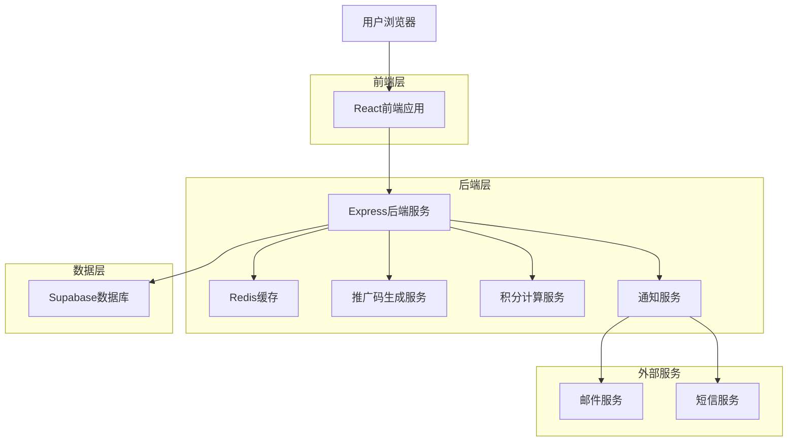
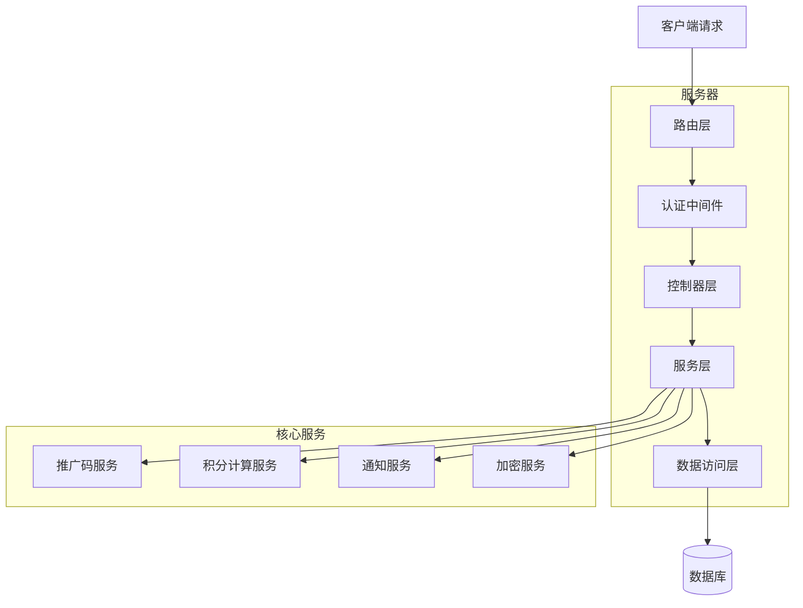
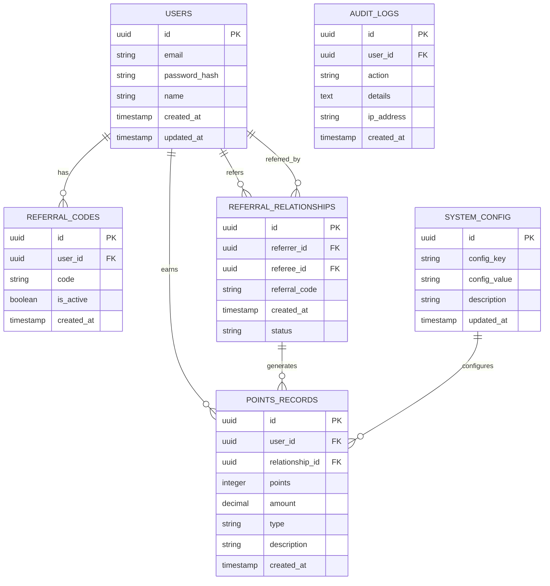

# 脑洞AI用户推广系统技术架构文档

## 1. 架构设计



## 2. 技术描述

- **前端**: React@18 + Ant Design@5 + React Router@6 + Axios
- **后端**: Express@4 + Node.js@18 + JWT认证
- **数据库**: Supabase (PostgreSQL)
- **缓存**: Redis@7
- **工具库**: crypto-js (加密) + qrcode (二维码) + moment (时间处理)

## 3. 路由定义

| 路由 | 用途 |
|------|------|
| /register | 用户注册页面，包含推广码输入功能 |
| /login | 用户登录页面，支持推广码关联 |
| /profile | 用户个人中心，显示推广数据和收益 |
| /referral | 推广管理页面，推广工具和统计 |
| /admin/referral | 后台推广管理，推广关系和配置 |
| /admin/settings | 后台系统设置，积分配置管理 |

## 4. API定义

### 4.1 推广码相关API

**生成推广码**
```
POST /api/referral/generate-code
```

Request:
| 参数名 | 参数类型 | 是否必需 | 描述 |
|--------|----------|----------|------|
| userId | string | true | 用户ID |

Response:
| 参数名 | 参数类型 | 描述 |
|--------|----------|------|
| code | string | 生成的推广码 |
| status | boolean | 生成状态 |

**验证推广码**
```
POST /api/referral/validate-code
```

Request:
| 参数名 | 参数类型 | 是否必需 | 描述 |
|--------|----------|----------|------|
| code | string | true | 推广码 |

Response:
| 参数名 | 参数类型 | 描述 |
|--------|----------|------|
| valid | boolean | 推广码是否有效 |
| referrer | object | 推广者信息 |

### 4.2 推广关系API

**建立推广关系**
```
POST /api/referral/create-relationship
```

Request:
| 参数名 | 参数类型 | 是否必需 | 描述 |
|--------|----------|----------|------|
| refereeId | string | true | 被推广用户ID |
| referralCode | string | true | 推广码 |

**获取推广统计**
```
GET /api/referral/stats/:userId
```

Response:
| 参数名 | 参数类型 | 描述 |
|--------|----------|------|
| totalReferrals | number | 总推广人数 |
| totalEarnings | number | 总推广收益 |
| recentReferrals | array | 最近推广记录 |

### 4.3 积分系统API

**计算推广积分**
```
POST /api/points/calculate-referral
```

Request:
| 参数名 | 参数类型 | 是否必需 | 描述 |
|--------|----------|----------|------|
| refereeId | string | true | 被推广用户ID |
| amount | number | true | 充值金额 |

**获取积分记录**
```
GET /api/points/history/:userId
```

Response:
| 参数名 | 参数类型 | 描述 |
|--------|----------|------|
| records | array | 积分变动记录 |
| totalPoints | number | 总积分 |

## 5. 服务器架构图



## 6. 数据模型

### 6.1 数据模型定义



### 6.2 数据定义语言

**用户表 (users)**
```sql
-- 创建用户表
CREATE TABLE users (
    id UUID PRIMARY KEY DEFAULT gen_random_uuid(),
    email VARCHAR(255) UNIQUE NOT NULL,
    password_hash VARCHAR(255) NOT NULL,
    name VARCHAR(100) NOT NULL,
    avatar_url VARCHAR(500),
    total_points INTEGER DEFAULT 0,
    created_at TIMESTAMP WITH TIME ZONE DEFAULT NOW(),
    updated_at TIMESTAMP WITH TIME ZONE DEFAULT NOW()
);

-- 创建索引
CREATE INDEX idx_users_email ON users(email);
CREATE INDEX idx_users_created_at ON users(created_at DESC);
```

**推广码表 (referral_codes)**
```sql
-- 创建推广码表
CREATE TABLE referral_codes (
    id UUID PRIMARY KEY DEFAULT gen_random_uuid(),
    user_id UUID NOT NULL REFERENCES users(id) ON DELETE CASCADE,
    code VARCHAR(12) UNIQUE NOT NULL,
    is_active BOOLEAN DEFAULT true,
    created_at TIMESTAMP WITH TIME ZONE DEFAULT NOW()
);

-- 创建索引
CREATE UNIQUE INDEX idx_referral_codes_code ON referral_codes(code);
CREATE INDEX idx_referral_codes_user_id ON referral_codes(user_id);
```

**推广关系表 (referral_relationships)**
```sql
-- 创建推广关系表
CREATE TABLE referral_relationships (
    id UUID PRIMARY KEY DEFAULT gen_random_uuid(),
    referrer_id UUID NOT NULL REFERENCES users(id) ON DELETE CASCADE,
    referee_id UUID NOT NULL REFERENCES users(id) ON DELETE CASCADE,
    referral_code VARCHAR(12) NOT NULL,
    status VARCHAR(20) DEFAULT 'active' CHECK (status IN ('active', 'inactive', 'completed')),
    first_purchase_at TIMESTAMP WITH TIME ZONE,
    created_at TIMESTAMP WITH TIME ZONE DEFAULT NOW()
);

-- 创建索引
CREATE INDEX idx_referral_relationships_referrer ON referral_relationships(referrer_id);
CREATE INDEX idx_referral_relationships_referee ON referral_relationships(referee_id);
CREATE UNIQUE INDEX idx_referral_relationships_unique ON referral_relationships(referrer_id, referee_id);
```

**积分记录表 (points_records)**
```sql
-- 创建积分记录表
CREATE TABLE points_records (
    id UUID PRIMARY KEY DEFAULT gen_random_uuid(),
    user_id UUID NOT NULL REFERENCES users(id) ON DELETE CASCADE,
    relationship_id UUID REFERENCES referral_relationships(id),
    points INTEGER NOT NULL,
    amount DECIMAL(10,2),
    type VARCHAR(20) NOT NULL CHECK (type IN ('referral_bonus', 'purchase_reward', 'manual_adjustment')),
    description TEXT,
    created_at TIMESTAMP WITH TIME ZONE DEFAULT NOW()
);

-- 创建索引
CREATE INDEX idx_points_records_user_id ON points_records(user_id);
CREATE INDEX idx_points_records_created_at ON points_records(created_at DESC);
CREATE INDEX idx_points_records_type ON points_records(type);
```

**系统配置表 (system_config)**
```sql
-- 创建系统配置表
CREATE TABLE system_config (
    id UUID PRIMARY KEY DEFAULT gen_random_uuid(),
    config_key VARCHAR(100) UNIQUE NOT NULL,
    config_value TEXT NOT NULL,
    description TEXT,
    updated_at TIMESTAMP WITH TIME ZONE DEFAULT NOW()
);

-- 插入初始配置
INSERT INTO system_config (config_key, config_value, description) VALUES
('referral_points_rate', '0.1', '推广积分比例（充值金额的10%）'),
('min_purchase_amount', '10', '最小充值金额（元）'),
('referral_code_length', '10', '推广码长度'),
('max_referral_levels', '3', '最大推广层级');
```

**审计日志表 (audit_logs)**
```sql
-- 创建审计日志表
CREATE TABLE audit_logs (
    id UUID PRIMARY KEY DEFAULT gen_random_uuid(),
    user_id UUID REFERENCES users(id),
    action VARCHAR(100) NOT NULL,
    details JSONB,
    ip_address INET,
    user_agent TEXT,
    created_at TIMESTAMP WITH TIME ZONE DEFAULT NOW()
);

-- 创建索引
CREATE INDEX idx_audit_logs_user_id ON audit_logs(user_id);
CREATE INDEX idx_audit_logs_action ON audit_logs(action);
CREATE INDEX idx_audit_logs_created_at ON audit_logs(created_at DESC);
```

**权限设置**
```sql
-- 为匿名用户授予基本权限
GRANT SELECT ON referral_codes TO anon;
GRANT SELECT ON system_config TO anon;

-- 为认证用户授予完整权限
GRANT ALL PRIVILEGES ON users TO authenticated;
GRANT ALL PRIVILEGES ON referral_codes TO authenticated;
GRANT ALL PRIVILEGES ON referral_relationships TO authenticated;
GRANT ALL PRIVILEGES ON points_records TO authenticated;
GRANT SELECT ON system_config TO authenticated;
GRANT INSERT ON audit_logs TO authenticated;
```